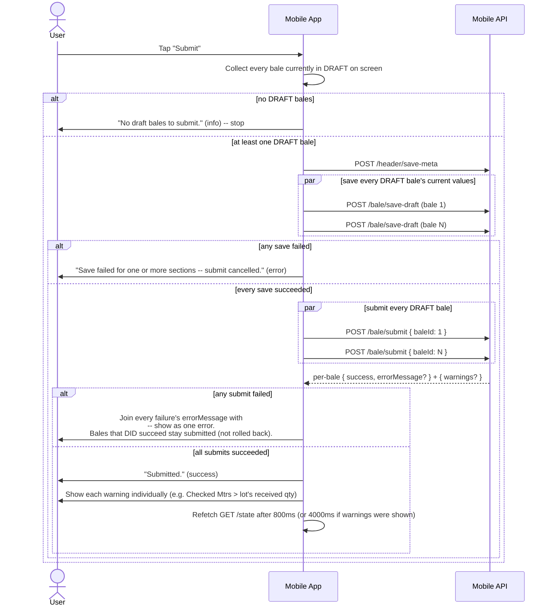

# GRN Checking -- Sequence Diagrams

Paths below are the new mobile-facing paths from `openapi.yaml`. See
`business-rules-and-flows.md` for the exact wording of every message
referenced here.

## 1. AI-upload async job/poll flow (shared by Lot, Bale, RM)

Covers the full lifecycle including Lot's fabric-mismatch-stop-then-resume
branch. Bale follows the identical shape (swap `/lot/upload/*` for
`/bale/upload/*`, `lotId` for `baleId`). RM follows the same shape minus the
fabric-mismatch branch entirely -- an RM invoice has no per-line fabric-match
gate, so RM never receives `fabricMismatchStopped: true`.

```mermaid
sequenceDiagram
    actor User
    participant App as Mobile App
    participant API as Mobile API
    participant AI as AI Extraction Service

    User->>App: Pick a document to upload for this lot
    App->>API: POST /lot/upload/async (multipart: file, lotId, expectedPoNumber, ...)
    API->>API: Store to S3
    API->>AI: Start extraction job (page 1)
    API-->>App: 200 { success, jobId, totalPages, completedPages }

    alt initial call failed (success=false)
        App->>User: Show errorMessage or "Extraction failed." -- stop, no job to poll
    else job started
        loop poll every 1.5s while running
            App->>API: GET /lot/upload/status?jobId=...
            API->>AI: (background) dispatch next page(s)
            API-->>App: 200 { jobStatus: "running", totalPages, completedPages }
            App->>User: Update progress line + Cancel control
        end

        API-->>App: 200 { jobStatus: "cancelled", ... }
        Note over App,API: (branch A) user clicked Cancel mid-poll
        App->>User: Show "Extraction cancelled." (warning); render any partial lot returned

        API-->>App: 200 { jobStatus: "done", success: false, fabricMismatchStopped: true, expectedFabricDescription, extractedFabricDescription, lot }
        Note over App,API: (branch B) page 1's fabric didn't match this PO line's
        App->>User: Render returned lot (audit row + partial data already recorded)
        App->>User: Confirm: "This document's fabric ('X') doesn't match ... Still process it?"
        alt user confirms
            App->>API: POST /lot/upload/resume { jobId }  (SAME jobId -- no re-upload)
            API->>AI: Dispatch remaining pages
            API-->>App: 200 { success: true }
            App->>App: Resume polling GET /lot/upload/status with the same jobId
        else user declines
            App->>User: Do nothing further
        end

        API-->>App: 200 { jobStatus: "done", success: true, lot, mismatched?, errorMessage? }
        Note over App,API: (branch C) terminal success
        alt mismatched = true
            App->>User: Show mismatchMessage (warning) -- "verify before approving"
        else errorMessage present
            App->>User: Show "Document read with some issues: ..." (warning)
        else
            App->>User: Show "Document read successfully." (success)
        end
        App->>User: Render the returned lot
    end
```

**Caption**: One job, one `jobId`, one polling loop -- the three terminal
branches (cancelled / mismatch-stopped / done) are mutually exclusive
outcomes of the SAME loop, not three separate flows. The mismatch-stopped
branch is the one genuinely stateful trap: resuming must reuse the existing
`jobId` (page 1 was already extracted and billed), never restart by
re-uploading the file.

## 2. Submit flow (Fabric bale)



**Caption**: Submit is deliberately "save everything visible, THEN submit
everything, per-bale independent" -- a save failure aborts the whole submit
before anything is submitted, but once submitting starts, each bale
succeeds or fails on its own; a mobile client must not treat one bale's
submit failure as reason to consider the others rolled back.

## 3. Approve flow (Fabric batch)

```mermaid
sequenceDiagram
    actor User
    participant App as Mobile App
    participant API as Mobile API

    User->>App: Check "Select for Approval" on a bale
    App->>App: Sum this bale's pieces[].checkedMtrs
    alt sum <= 0
        App->>User: "Cannot select this bale for approval: no Checked Mtrs recorded yet." (warning)<br/>Un-check the box -- no request sent
    else sum > 0
        App->>API: POST /bale/save-draft (force-save current on-screen values FIRST)
        alt save failed
            App->>User: errorMessage or "Could not save this bale -- not selected for approval." (error)<br/>Un-check the box
        else save succeeded
            App->>App: Add baleId to the selected set; update the floating "N bales selected" summary
        end
    end

    User->>App: Tap "Approve" (page-level, acts on the whole selected set)
    App->>User: Confirm: "Approve N selected bale(s)? This will add their checked quantity to inventory, generate one GRN No for all of them together, and cannot be undone."
    User->>App: Confirms
    App->>API: POST /bale/approve-batch { baleIds: [...] }
    Note over API: All-or-nothing: validates every bale first (already-APPROVED,<br/>zero Checked Mtrs, or lot received-qty ceiling -- accounting for every<br/>OTHER bale in this same batch too) -- nothing is written until every one passes.
    alt validation failed
        API-->>App: { success: false, errorMessage }
        App->>User: Show errorMessage or "Approve failed." (error)
    else batch approved
        API-->>App: { success: true, grnNo, updatedLots: [...], warnings: [...] }
        App->>User: "Approved. GRN No: {grnNo}" (success)
        App->>User: Show each warning individually
        App->>App: Re-render each lot in updatedLots in place (NOT a full page reload)
        App->>App: Clear the selected-bales set
    end
```

**Caption**: Two distinct save points exist before an approve ever reaches
the server: selecting the checkbox force-saves that one bale immediately
(so approval can never read stale data), and the batch approve call itself
is still all-or-nothing across every selected bale together. Unlike Submit,
a successful approve updates the UI from the response's own `updatedLots`
rather than triggering a full state refetch.
